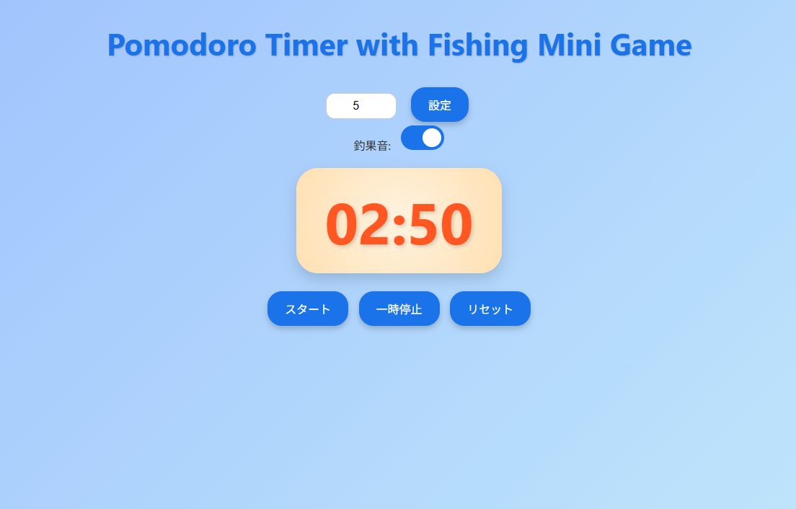

# Pomodoro Timer with Fishing Mini Game

## Demo
https://sct202509kato.github.io/pomodoro-fishing-timer/

## 概要
作業に集中するためのポモドーロタイマーです。  
一定時間（2分）ごとに魚が釣れるミニゲーム要素を追加し、
作業を継続するモチベーションを高めることを目的に制作しました。

「ただ時間を測るだけでなく、少し楽しく作業できるツール」を
目指して設計しています。

## 機能
- ポモドーロタイマー機能
- 2分ごとにランダムで魚が釣れるイベント
- 釣れた魚の一覧表示

## 工夫した点
- JavaScript の `setInterval` を使った時間管理の実装
- タイマー処理とゲーム処理を分離し、状態が崩れないように設計
- 配列で釣れた魚を管理し、後からまとめて確認できるようにした点

## 苦労した点
- タイマーの開始・停止時に処理が二重に実行されないよう制御した点
- 画面表示と内部データの状態を常に一致させる部分

## 使用技術
- HTML
- JavaScript（Vanilla JS）

## 制作背景
JavaScriptの基礎学習のアウトプットとして、
「実際に使える小さなアプリを最後まで作り切ること」を
目標に制作しました。

## 今後の改善予定
- 釣れる魚（絵文字）の種類追加
- Renderでのデプロイ
